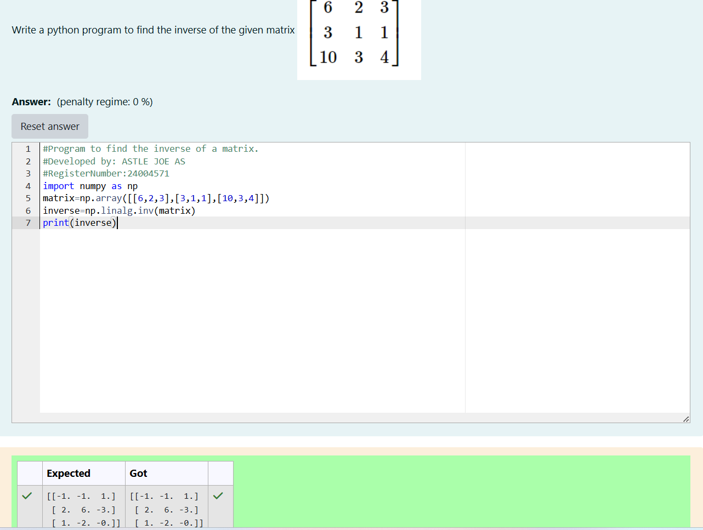

# INVERSE-OF-A-MATRIX
## Aim:
To write a python program to find the inverse of a matrix
## Equipment’s required:
1. 	Hardware – PCs
2. 	Anaconda – Python 3.7 Installation / Moodle-Code Runner
## Algorithm:
### Step1 : import numpy as np
### Step 2: Get input value as np.array([[6,2,3],[3,1,1],[10,3,4]])
### Step 3: Now find inverse of a matrix by np.linalg.inv(matrix)
### Step 4: Now print the output

## Program:
 ```   #Program to find the inverse of a matrix.
    #Developed by: ASTLE JOE AS
    #RegisterNumber:24004571
    import numpy as np
    matrix=np.array([[6,2,3],[3,1,1],[10,3,4]])
    inverse=np.linalg.inv(matrix)
    print(inverse)
```
## Output:

## Result:
Thus the inverse of given matrix is successfully solved using python program

